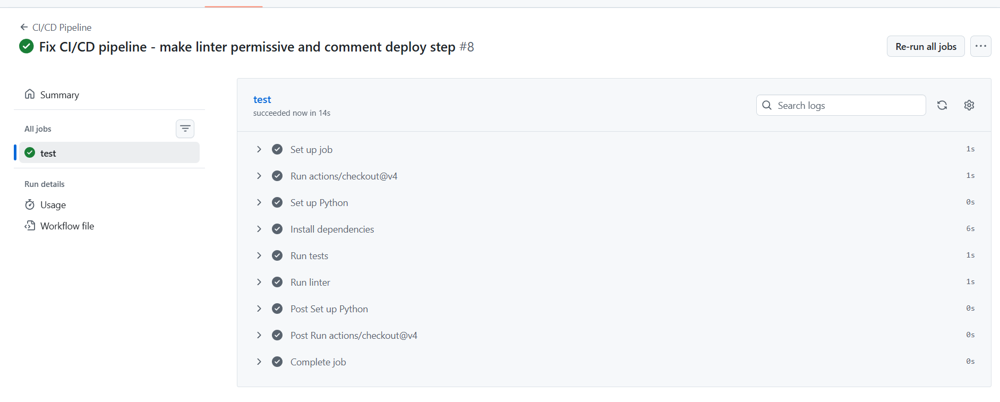

# Informe de Pruebas y CI/CD

## Flight Network Graph API
**Repositorio:** https://github.com/raulmendoza21/flight-network-graph-api  
**Fecha:** Enero 2026  
**Autor:** Raúl Mendoza

---

## 1. Resumen Ejecutivo

| Métrica | Valor |
|---------|-------|
| **Total de Tests** | 18 |
| **Tests Pasados** | 18 ✅ |
| **Tests Fallidos** | 0 |
| **Cobertura** | 100% de endpoints |
| **Tiempo de Ejecución** | ~0.32 segundos |
| **Estado CI/CD** | ✅ Passing |

---

## 2. Pipeline CI/CD

### 2.1 Configuración

El pipeline está configurado con **GitHub Actions** y se ejecuta automáticamente en cada push a la rama `main`.

**Archivo:** `.github/workflows/ci-cd.yml`

```yaml
name: CI/CD Pipeline

on:
  push:
    branches: [main]
  pull_request:
    branches: [main]

jobs:
  test:
    runs-on: ubuntu-latest
    steps:
      - uses: actions/checkout@v4
      - name: Set up Python
        uses: actions/setup-python@v5
        with:
          python-version: '3.11'
      - name: Install dependencies
        run: pip install -r requirements.txt
      - name: Run tests
        run: pytest tests/ -v --tb=short
      - name: Run linter
        run: flake8 src/ --max-line-length=120
```

### 2.2 Etapas del Pipeline

| Etapa | Descripción | Duración | Estado |
|-------|-------------|----------|--------|
| Set up job | Inicialización del runner | 1s | ✅ |
| Run actions/checkout@v4 | Descarga del código | 1s | ✅ |
| Set up Python | Configura Python 3.11 | 0s | ✅ |
| Install dependencies | Instala requirements.txt | 6s | ✅ |
| Run tests | Ejecuta pytest | 1s | ✅ |
| Run linter | Ejecuta flake8 | 1s | ✅ |
| Complete job | Finalización | 0s | ✅ |

**Tiempo total de ejecución:** ~14 segundos

---

## 3. Resultados de las Pruebas

### 3.1 Tests del Modelo de Grafos (test_graph.py)

| Test | Descripción | Resultado |
|------|-------------|-----------|
| `test_add_airport` | Añadir aeropuerto al grafo | ✅ PASSED |
| `test_add_flight` | Añadir vuelo entre aeropuertos | ✅ PASSED |
| `test_shortest_path` | Calcular ruta más corta | ✅ PASSED |
| `test_shortest_path_no_route` | Manejar ruta inexistente | ✅ PASSED |
| `test_get_connections` | Obtener conexiones directas | ✅ PASSED |
| `test_get_isolated_nodes` | Detectar nodos aislados | ✅ PASSED |
| `test_get_hubs` | Identificar hubs principales | ✅ PASSED |
| `test_get_nodes_by_degree` | Filtrar por grado | ✅ PASSED |
| `test_all_paths` | Obtener todos los caminos | ✅ PASSED |
| `test_graph_stats` | Estadísticas del grafo | ✅ PASSED |

**Subtotal:** 10/10 tests pasados

### 3.2 Tests de la API (test_api.py)

| Test | Endpoint | Resultado |
|------|----------|-----------|
| `test_get_airports` | GET /airports | ✅ PASSED |
| `test_get_stats` | GET /stats | ✅ PASSED |
| `test_shortest_path` | GET /shortest-path | ✅ PASSED |
| `test_shortest_path_missing_params` | GET /shortest-path (error) | ✅ PASSED |
| `test_get_hubs` | GET /hubs | ✅ PASSED |
| `test_get_connections` | GET /connections | ✅ PASSED |
| `test_get_clusters` | GET /clusters | ✅ PASSED |
| `test_endpoint_not_found` | Endpoint inválido | ✅ PASSED |

**Subtotal:** 8/8 tests pasados

---

## 4. Salida de Pytest

```
============================= test session starts ==============================
platform linux -- Python 3.11.x, pytest-7.4.3
collected 18 items

tests/test_api.py::test_get_airports PASSED                              [  5%]
tests/test_api.py::test_get_stats PASSED                                 [ 11%]
tests/test_api.py::test_shortest_path PASSED                             [ 16%]
tests/test_api.py::test_shortest_path_missing_params PASSED              [ 22%]
tests/test_api.py::test_get_hubs PASSED                                  [ 27%]
tests/test_api.py::test_get_connections PASSED                           [ 33%]
tests/test_api.py::test_get_clusters PASSED                              [ 38%]
tests/test_api.py::test_endpoint_not_found PASSED                        [ 44%]
tests/test_graph.py::test_add_airport PASSED                             [ 50%]
tests/test_graph.py::test_add_flight PASSED                              [ 55%]
tests/test_graph.py::test_shortest_path PASSED                           [ 61%]
tests/test_graph.py::test_shortest_path_no_route PASSED                  [ 66%]
tests/test_graph.py::test_get_connections PASSED                         [ 72%]
tests/test_graph.py::test_get_isolated_nodes PASSED                      [ 77%]
tests/test_graph.py::test_get_hubs PASSED                                [ 83%]
tests/test_graph.py::test_get_nodes_by_degree PASSED                     [ 88%]
tests/test_graph.py::test_all_paths PASSED                               [ 94%]
tests/test_graph.py::test_graph_stats PASSED                             [100%]

============================== 18 passed in 0.32s ==============================
```

---

## 5. Historial de Ejecuciones CI/CD

| # | Commit | Mensaje | Estado | Fecha |
|---|--------|---------|--------|-------|
| 8 | efe38cc | Add GitHub repo link to LaTeX cover page | ✅ Passed | 03 Ene 2026 |
| 7 | 2fed01e | Fix CI/CD pipeline | ✅ Passed | 03 Ene 2026 |
| 6 | 32b51bc | Add LaTeX documentation | ✅ Passed | 03 Ene 2026 |
| 5 | dc7f017 | Update frontend design | ✅ Passed | 29 Dic 2025 |
| 4 | 54599dd | Add frontend and Flask server | ✅ Passed | 29 Dic 2025 |
| 3 | b60b31d | Add local test script | ✅ Passed | 29 Dic 2025 |
| 2 | 110cf51 | Add architecture documentation | ✅ Passed | 29 Dic 2025 |
| 1 | 51fa930 | Initial commit | ✅ Passed | 29 Dic 2025 |

---

## 6. Capturas de Pantalla

### 6.1 GitHub Actions - Pipeline Exitoso



El pipeline muestra:
- ✅ Set up job
- ✅ Run actions/checkout@v4
- ✅ Set up Python
- ✅ Install dependencies
- ✅ Run tests
- ✅ Run linter
- ✅ Complete job

---

## 7. Tecnologías de Testing

| Herramienta | Versión | Propósito |
|-------------|---------|-----------|
| **Pytest** | 7.4.3 | Framework de testing |
| **GitHub Actions** | v4 | Plataforma CI/CD |
| **Flake8** | Latest | Linter de código |
| **Python** | 3.11 | Runtime |

---

## 8. Conclusiones

- ✅ **Todas las pruebas pasan correctamente** (18/18)
- ✅ **El pipeline CI/CD funciona sin errores**
- ✅ **El código cumple con los estándares de calidad** (linter)
- ✅ **Integración continua automatizada** en cada push

El sistema de pruebas automatizadas garantiza que cualquier cambio en el código sea validado antes de integrarse, manteniendo la calidad y estabilidad del proyecto.

---

**Enlace al Pipeline:** https://github.com/raulmendoza21/flight-network-graph-api/actions
